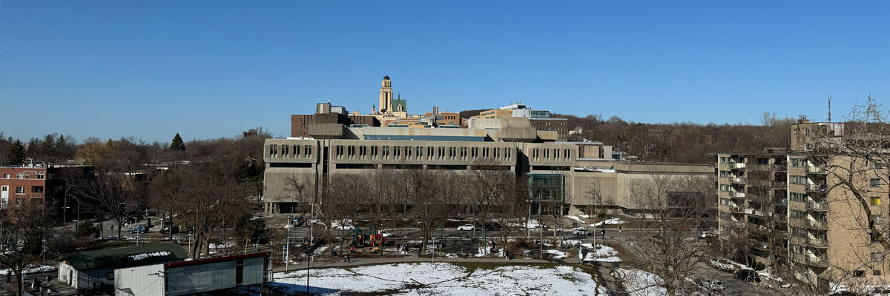

# lettre de déménagement

## amélioration

<audio controls>
  <source src="/audios/1712524555_01.mp3" type="audio/mpeg" />
</audio>

Bonjour Tommy,

Félicitations pour avoir obtenu ta carte verte ! Tu peux enfin souffler maintenant !

De mon côté, j'ai récemment déménagé. Mon ancien coloc, Alex, qui est aussi mon meilleur ami, a décidé de commencer à vivre avec sa copine. Comme l'appartement n'était pas très grand, enfin, certainement pas assez grand pour moi et mes deux oiseaux adorés, j'ai pensé qu'il était temps de changer d'air. Je pense aussi qu'ils méritent un peu plus d'espace. Alors j'ai décidé de déménager. Oui, Alex va me manquer, car nous étions ensemble depuis l'université. D'ailleurs, c'est peut-être aussi pour cela que nous avons été célibataires pendant si longtemps, car les gens pensaient que nous étions en couple... Alors c'est aussi bien pour moi, peut-être que je trouverai quelqu'un bientôt ?

Le déménagement a été épuisant et j'ai cassé mon imprimante. J'attends le vendredi fou pour en acheter une nouvelle. Mon nouvel appartement est situé dans le quartier Côte-des-Neiges. La plupart de mes voisins sont des étudiants, donc le quartier est très animé. La pharmacie, le supermarché et la station de métro sont tous à seulement 3 minutes à pied. Je peux même voir le Mont-Royal depuis mon balcon. Le salon est très ensoleillé avec des fenêtres du plancher au plafond. Il est même plus grand que ton appartement à San Francisco. J'ai aussi acheté un lit supplémentaire et l'ai installé. Tu as toujours voulu visiter Montréal, maintenant tu peux planifier cela. Tu peux rester chez moi et les hôtels sont chers !

Ah, et Thomas vient aussi cet été pour son documentaire, en août si je me souviens bien. Si vous venez en même temps, vous devrez vous battre pour avoir le droit d'utiliser le lit. Celui qui perdra devra dormir sur le canapé.

Bien à toi,

Arthur

## originale

Bonjour Tommy,

Félicitations pour avoir obtenu votre carte verte! Tu peux soulager maintenant!

Et moi, j’ai récemment déménagé. Mon ancien coloc Alex qui est aussi mon meilleur ami, a décidé commencer vivre avec sa blonde. Et l'appartement n'était pas très grand, enfin, certainement pas assez grand pour moi et deux oiseaux aimants. Je pense aussi que je devrais leur donner plus d'espace. J'ai donc décidé de déménager. Oui, il va me manquer, puisque nous étions ensemble depuis l'université. Et bien c’est aussi pour cela que nous avons été célibataires pendant si longtemps parce que d’autres pensaient que nous étions en couple… Alors c’est aussi bien pour moi, peut-être que je trouverai quelqu’un aussi bientôt ?

Le déménagement a été épuisant et j’ai cassé mon imprimante. J’attends le vendredi fou pour acheter un autre. Mon nouvel appartement est situé à quartier Côte-des-Neiges. La plupart de mes voisins sont des étudiants alors le quartier est très animé. La pharmacie, le supermarché et la station de métro sont tous à seulement 3 minutes à pied. Je peux voir le Mont-Royal depuis le balcon. Le salon est très ensoleillé avec des fenêtres du plancher au plafond. Il est même plus grand que ton appartement à San Francisco. J’ai aussi acheté un extra lit et je l’y ai installé. tu as toujours voulu visiter Montréal. maintenant vous pouvez planifier cela. Tu peux rester chez moi et les hôtels sont chers!

Bon, Thomas vient aussi cet été pour son documentaire, en août si je me souviens bien. Si vous venez en même temps, vous devrez vous battre pour avoir le droit d'utiliser le lit, celui qui perdra devra dormir sur le canapé.

Bien à toi,

Arthur.
