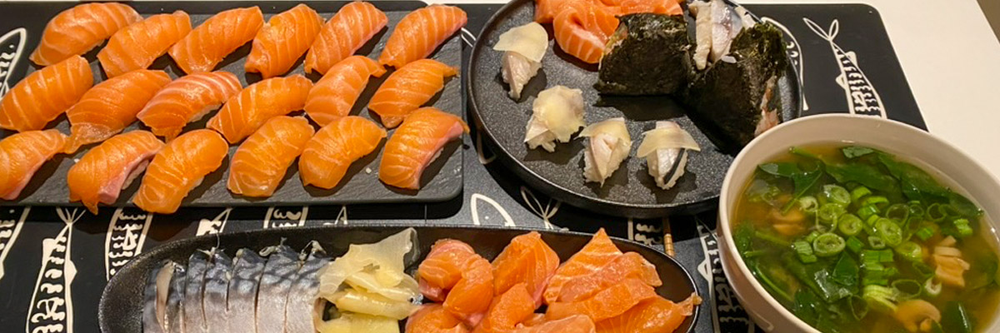

# Sushi

## amélioration

<audio controls>
  <source src="/audios/1712700401_01.mp3" type="audio/mpeg" />
</audio>

Après avoir décidé de déménager à Montréal, Alex a cherché un appartement dans le centre-ville et y a emménagé. Quatre mois plus tard, j'ai pris un vol transcontinental depuis Vancouver pendant cinq heures et suis arrivé à l'aéroport YUL à 7 heures et demie du matin.

Je pensais que cela ne serait pas si difficile, mais je me trompais. C'était même plus difficile que les vols transpacifiques. Une fois arrivé à l'appartement, j'ai pris une douche pour réfléchir. Ensuite, je me suis couché sur le lit d'Alex car il n'y avait qu'un lit dans la chambre, et l'appartement manquait de beaucoup de choses. On est allé dans un restaurant japonais le soir après la fin du travail d'Alex. J'ai souscrit au forfait Fizz pour mon téléphone avec la carte SIM qu'il m'avait achetée à mon retour. C'était mon premier jour de vie à Montréal.

Après quelques semaines à parcourir IKEA, Canadian Tire, Dollarama, Marshall’s et mon appartement, je peux enfin dire que j'ai un chez-moi. J'aime toujours bricoler, et j'ai remplacé toutes les ampoules par des ampoules intelligentes pour rendre la maison un peu plus moderne. Alex m'a suggéré d'acheter un lit superposé, mais je n'ai pas aimé cette idée. J'ai fini par acheter un grand canapé, qui, je pense, est plus grand que le lit de la plupart des gens. Il m'arrive parfois de m'endormir devant la télévision tellement c'est confortable.

On aime les plats japonais, surtout les sushis et sashimis. Je pense que tout le monde aime ça. Il y a beaucoup de restaurants japonais sur la rue Sainte-Catherine, et on les a tous essayés. Cependant, on n'aimait pas les sushis et sashimis qu'ils servaient, car ils n'étaient pas du tout bons. On savait reconnaître les bons sushis, et on a été déçus par les restaurants japonais du centre-ville. Bien sûr, il y a de très bons restaurants japonais à Montréal, mais ils sont vraiment chers. J'ai suggéré de faire nous-mêmes nos sushis et sashimis. J'ai prétendu savoir bien préparer les bons sushis, mais c'était un mensonge car je n'avais aucune confiance dans les compétences culinaires d'Alex. C'est donc moi qui me suis retrouvé à mettre en pratique cette idée.

Bien sûr, cela m'a pris beaucoup de temps pour préparer de bons sushis et sashimis. Je prépare le riz moi-même, je prépare le poisson moi-même, et ma découpe de poisson est plutôt bonne maintenant. Rien que le riz est bien meilleur que celui des restaurants du centre-ville. Alex a toujours voulu que je cuisine des sushis, et on en a beaucoup mangé, vraiment beaucoup. J'ai toujours réussi à garder le prix autour de 25 $, donc c'était bien, et il n'y avait plus aucune raison de fréquenter ces restaurants chers.

Pendant le dernier Nouvel An, j'ai parlé à Sai en vidéo. Il a vu mes sushis et sashimis et a été surpris de leur qualité, les comparant à ceux préparés par des chefs professionnels au Japon. J'étais heureux, non seulement à cause de ses compliments, mais aussi parce que nous avons beaucoup discuté ce jour-là. On se rencontrait rarement depuis son déménagement à Tokyo, je pense que cela fait plus de 15 ans maintenant. J'étais heureux de voir qu'il s'était bien installé là-bas. On a parlé de beaucoup de choses de notre enfance et il m'a montré qu'il gardait la carte de Noël que je lui avais envoyée à l'époque. J'étais gêné de lire les mots que j'avais écrits, me demandant comment j'avais pu écrire quelque chose comme ça quand j'étais si jeune ? Naïf et ambitieux, eh bien, c'était typique de l'enfance. On a également discuté de certains projets futurs, juste des idées pour le moment, non arrêtées. Mais je lui rendrai visite, lui et sa femme, à l'avenir, et ils viendront aussi à Montréal un jour. On se reverra un jour.

Et mes secrets pour préparer de bons sushis sont en fait très simples. Tu t'imagineras jamais ! Rien qu'en 2023, j'ai cuisiné des sushis plus de 200 fois !

## originale

Après j’avait décidé de déménager à Montréal, Alex a cherché un appartement dans le centre ville et y emménagé. 4 mois plus tard, j’ai pris le vol transcontinental de Vancouver pour 5 heures et je suis arrivé à l’aéroport Trudeau a 7 heures et demie.

Je pensais que ce ne serait pas si grave mais j'avais tort. C’était même grave que les vols trans pacifique. Après arrivé l’appartement jais pris une douche pour me réfléchir. Puis j’ai dormi sur lit d’Alex parce qu’il n’avait qu’un lit dans la chambre. Et il manquait beaucoup de chose dan l’appartement. On est allé un restaurant japonais le soir après Alex a finit son travail. Je m’ai abonné le fizz pour téléphone avec la carte de SIM il m’a acheté après le rentré. c'était mon premier jour de vie à Montréal.

Après quelques semaines de trajet entre IKEA, Canadian Tire, Dollarama, Marshall’s et chez moi. Je peux finalement s’appeler une domicile. J'aime toujours faire le bricolage et j'ai changé toutes les lumières avec des lumières intelligentes pour rendre la maison un peu plus intelligente. Alex m'a suggéré d'acheter un lit superposé, mais je n'aime pas ça. J’ai fini par acheter un grand canapé qui, je pense, est plus grand que le lit de la plupart des gens. Je m'endormais parfois en regardant la télévision parce que c'était très confortable.

On aime les plats japonais, surtout le sushi et sashimi. Tout le monde aime ça je pense. Il y a beaucoup de restaurant japonais sur la rue Sainte-Catherine et on les a déjà tous visité. On n’aime pas les sushi et sashimis qu’ils servaient, car ils n’étaient pas bons du tout. On savait comment les bons sushis sentaient. on a été déçus par les restaurants japonais dans le centre ville. Bien, il y a de très bons restaurants japonais à Montréal mais ils sont vraiment chers. J’ai suggéré de faire les sushis et sashimi soi-même. Je lui a dit j’ai connaît bien comment preparer les bons sushis. En fait, c’était un mensonge parce ce que je ne faisais aucune confiance aux compétences culinaires d’Alex. Donc je devais me lever pour concrétiser cette idée.

Bien sûr, il m’a fallu beaucoup de temps pour réaliser de bons sushis et sashimis. Je prépare le riz moi-même, je prépare le poisson moi-même, et ma découpe du poisson est plutôt bonne maintenant. Rien que le riz est bien meilleur que ces restaurants du centre-ville. Alex a toujours voulu que je cuisine des sushis, et on mangeait beaucoup, vraiment beaucoup. J'ai gardé le prix à chaque fois autour de 25$ donc c'était bien, il n'y avait plus aucune raison de visiter ces restaurants chers.

Au Nouvel An dernier, j'ai parlé avec Sai en vidéo. Il a vu mes sushis et sashimis, il a été surpris qu'ils soient si bons, comme ceux préparés par des chefs professionnels au Japon. J'étais heureux, non seulement à cause de son complément, mais aussi parce que nous avons longuement discuté ce jour-là. On se rencontrait rarement après son déménagement à Tokyo, je pense, depuis plus de 15 ans. J'étais heureux qu'il s'y soit bien installé. On a parlé de beaucoup de choses pendant notre école primaire, et il m'a montré qu'il gardait ma carte de Noël que je lui avais alors envoyée. J'étais tellement gêné de lire les mots que j'écrivais, comment ai-je pu écrire quelque chose comme ça quand j'étais si jeune ? Naïf et ambitieux, eh bien, c'était quelque chose qu'un enfant aurait écrit, c'était l'enfance. On a aussi parlé de certains projets futurs, juste des idées maintenant, non figées. Mais je lui rendrai visite, lui et sa femme, à l'avenir, et ils visiteront aussi Montréal un jour. On se reverra un jour.

Et mes secrets pour faire de bons sushis, c'est en fait très simple. Tu t'imagineras jamais! Rien qu’en 2023, j’ai cuisiné des sushis plus de 200 fois!
