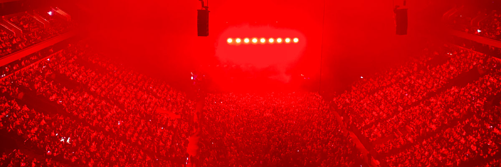

# Multitude

## amélioration

<audio controls>
  <source src="/audios/1713143956_01.mp3" type="audio/mpeg" />
</audio>

Deux semaines avant mon avion pour Montréal, j'ai demandé à Alex s'il voulait voir des concerts. Alex m'a dit que Stromae ferait des tournées cette année et viendrait à Montréal. J'ai cherché sur TicketMaster pour vérifier les billets. On a eu de la chance, il restait quelques billets pour le spectacle de la dernière journée à Montréal. J'ai choisi 2 sièges les moins chers et j'ai payé. Alex aimait beaucoup cet artiste mais c'était la première fois que j'entendais parler de lui. Alors j'ai commencé à écouter ses chansons.

Si je me souviens bien, c'était aussi le dernier jour de ses tournées mondiales. Ce jour-là, après le travail d’Alex, on a pris le métro et on est descendus à la station Peel. J'avais déjà emménagé à Montréal depuis 6 semaines et je pensais pouvoir trouver le chemin du Centre Bell. Oui, je peux le faire maintenant, mais ce jour-là, c'était le soir, j'avais du mal à trouver la bonne direction. J'ai finalement dû ouvrir Apple Maps pour m'aider.

On a trouvé nos places après notre arrivée. J'ai acheté les billets les moins chers mais avec une bonne position, la scène était juste devant nous, elle était juste un peu loin de nos places. Avant de quitter la maison, Alex m'a dit qu’on pouvait partir plus tard, mais j'ai insisté pour partir et arriver à l'heure. Et on est arrivés à l’heure, en fait 20 minutes avant le début du spectacle . Une chanteuse invitée est montée sur scène pour l'échauffement. Et elle a chanté pendant une heure complète avant que Stromae n'arrive sur scène. Et j'ai compris pourquoi Alex a dit ça. Au moment où Stromae est monté sur scène, tous les sièges étaient pleins.

La performance était incroyable et pour les 2 dernières chansons, Stromae a invité tout le monde à se lever, chanter et danser ensemble. Je pense que s'il revient à Montréal, j'irai certainement à son concert une fois de plus. Alors que le Centre Bell peut accueillir plus de 21 000 spectateurs pour un match de hockey de la LNH ou un événement sportif, la capacité totale pour un concert majeur est d'environ 15 000 places. Je ne sais pas combien de personnes étaient là ce soir-là, c’était beaucoup. Et quitter la salle après le concert était très très lent. La file d'attente avançait très lentement, et même après avoir quitté le Centre Bell, il y avait une longue file d'attente pour entrer dans le métro. On est donc allés chez McDo pour chercher à manger, et l'attente a également été longue.

La musique est magique. J'écoute de la musique pendant mes études, mes travaux, mes voyages, lorsque j'étais amoureux ou lorsque je me sentais déprimé. Si j'écoute maintenant les chansons des Backstreet Boys, NSync ou Savage Garden, cela me rappellera mes souvenirs de lycée. Parce que c’est à cette époque que j’écoutais le plus leurs chansons. Et les souvenirs sont si vifs, avec des sentiments et des émotions comme si je revivais le moment présent. Les chansons de Stromae me ramènent toujours à la première année où j'ai déménagé à Montréal et me permettent de revivre son concert Multitude Tour ce soir-là.

## originale

2 semaines avant mon avion pour Montréal, j'ai demandé à Alex s'il voulait voir des concerts. Alex m'a dit que Stromae ferait des tournées cette année et viendrait à Montréal. J'ai cherché sur TicketMaster pour vérifier les billets. On a eu de la chance, il restait quelques billets pour le spectacle de la dernière journée à Montréal. J'ai choisi 2 sièges les moins chers et j'ai payé. Alex aimait beaucoup cet artiste mais c'était la première fois que j'entendais parler de lui. Alors j'ai commencé à écouter ses chansons.

Si je me souviens bien, c'était aussi le dernier jour de ses tournées mondiales. Ce jour-là, après le travail d’Alex, On a pris le métro et on est descendus à la station Peel. J'ai déjà emménagé à Montréal depuis 6 semaines et je pensais pouvoir trouver le chemin du Centre Bell. Oui, je peux le faire maintenant, mais ce jour-là, c'était le soir, j'avais du mal à trouver la bonne direction. J'ai finalement dû ouvrir Apple Maps pour m'aider.

On a trouvé nos places après notre arrivée. J'ai acheté les billets les moins chers mais avec une bonne position, la scène était juste devant nous, elle était juste un peu loin de nos places. Avant de quitter la maison, Alex m'a dit qu’on pouvait partir plus tard, mais j'ai insisté pour partir et arriver à l'heure. Et on est arrivés à l’heure, en fait 20 minutes avant le début du spectacle . Une chanteuse invitée est montée sur scène pour l'échauffement. Et elle a chanté pendant une heure complète avant que Stromae n'arrive sur scène. Et j'ai compris pourquoi Alex a dit ça. Au moment où Stromae est monté sur scène, tous les sièges étaient pleins.

La performance était incroyable et pour les 2 dernières chansons, Stromae a invité tout le monde à se lever, chanter et danser ensemble. Je pense que s'il revient à Montréal, j'irai certainement à son concert une fois de plus. Alors que le Centre Bell peut accueillir plus de 21 000 spectateurs pour un match de hockey de la LNH ou un événement sportif, la capacité totale pour un concert majeur est d'environ 15 000 places. Je ne sais pas combien de personnes étaient là ce soir-là, c’était beaucoup. Et quitter la salle après le concert était très très lent. La file d'attente avançait très lentement, et même après avoir quitté le Centre Bell, il y avait une longue file d'attente pour entrer dans le métro. On est donc allés chez McDo pour chercher à manger, et l'attente a également été longue.

La musique est magique. J'écoute de la musique pendant mes études, mes travaux, mes voyages, lorsque j'étais amoureux ou lorsque je me sentais déprimé. Si j'écoute maintenant les chansons des Backstreet Boys, NSync ou Savage Garden, cela me rappellera mes souvenirs de lycée. Parce que c’est à cette époque que j’écoutais le plus leurs chansons. Et les souvenirs sont si vifs, avec des sentiments et des émotions comme si je revivais le moment présent. Les chansons de Stromae me ramènent toujours à la première année où j'ai déménagé à Montréal et me permettent de revivre son concert Multitude Tour ce soir-là.
