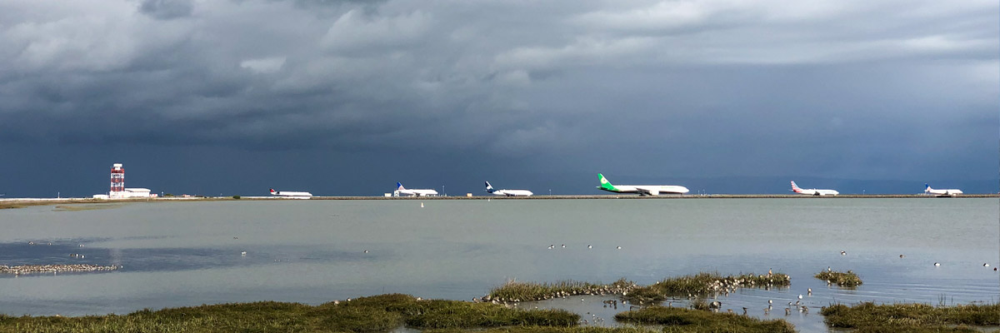

# chaque hiver, on va au bord de la mer

## amélioration

<audio controls>
  <source src="/audios/1712432651_01.mp3" type="audio/mpeg" />
</audio>

- Avant, on allait au Canton chaque hiver.
- Là-bas, il faisait plus doux que là où j'habitais.
- On passait du temps avec mes amis.
- On s'asseyait autour de la table.
- On se parlait sur des nouvelles de l'année passée.
- On partageait des projets pour l'avenir.
-
- Chaque nuit, on allait au bord de la mer.
- On regardait les lumières de la ville de l'autre côté.
- Ça changeait beaucoup même si c'est toujours pareil la nuit.
- On n'y pouvait rien.
- On ne pouvait pas y aller librement même si ça fait partie de notre pays.
- On parlait des possibilités mais on avait toujours fini par abandonner.
-
- Chaque nuit, on allait au bord de la mer.
- On regardait les lumières dans la mer.
- C'étaient les bateaux connectant les villes.
- C'étaient des gens occupés à vivre leur vie.
- On n'y pouvait rien.
- On parlait des possibilités mais on avait toujours fini par abandonner.
-
- Chaque nuit, on allait au bord de la mer.
- On regardait les lumières dans le ciel.
- C'étaient les avions décollant et atterrissant.
- C'étaient des gens qui venaient et quittaient le pays.
- On parlait des possibilités mais on avait toujours fini par abandonner.
-
- Après avoir grandi, on n'y allait plus, mes amis aussi.
- On a déjà tous quitté notre pays.
- Depuis,
- On va se retrouver en Californie chaque hiver.
- On va aller au bord de la mer.
- On va regarder les bateaux et les avions avec des gens de liberté.

## originale

- avant, j'allais au Canton chaque hiver
- là-bas, il faisait plus doux que là où j'habitais
- je passais du temps avec mes amis
- on s'asseyait autour la table
- on se parlait sur des nouvelles de l'année passée
- on partageait des projets pour l'avenir
-
- chaque nuit, on allait au bord de la mer
- on regardait les lumières de la ville de l'autre côté
- ça changeait beaucoup même si c'est toujours pareil la nuit
- on n'y pouvait rien
- on ne pouvait pas y aller librement même si ça fait partie de notre pays
- on parlait des possibilités mais on avait toujours fini par abandonner
-
- chaque nuit, on allait au bord de la mer
- on regardait les lumières dans la mer
- c'étaient les bateaux connectant les villes
- c'étaient des gens occupés à vivre leur vie
- on n'y pouvait rien
- on parlait des possibilités mais on avait toujours fini par abandonner
-
- chaque nuit, on allait au bord de la mer
- on regardait les lumières dans le ciel
- c'étaient les avions décollant et atterrissant
- c'étaient des gens qui venaient et quittaient le pays
- on parlait des possibilités mais on avait toujours fini par abandonner
-
- après avoir grandi, je n'y vais plus, mes amis aussi
- on a déjà tous quitté notre pays
- depuis
- on va se retrouver en Californie chaque hiver
- on va aller au bord de la mer
- on va regarder les bateaux et les avions avec des gens de liberté
