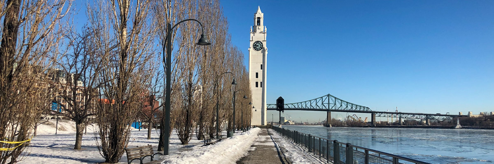

# un endroit que j'aime à MTL

## amélioration

<audio controls>
  <source src="/audios/1712432194_01.mp3" type="audio/mpeg" />
</audio>

C’était l’hiver lorsque j’ai visité Montréal pour la première fois en 2018. Je me suis promené le long du fleuve Saint-Laurent dans le Vieux-Port le matin. Ensuite, je me suis assis sur un banc en lisant un livre que j’avais acheté dans une charmante librairie située près de l’UQAM la veille au soir. J’ai trouvé l’atmosphère calme et j’ai apprécié le soleil d’hiver. Même maintenant, quand je me sens stressé, je prends souvent la clé des champs pour me détendre en visitant le Vieux-Port. Passer du temps calme là-bas me détend toujours et me permet de commencer une nouvelle journée. Cela fait presque deux ans depuis que j’ai emménagé à Montréal. Il y a encore tant de choses à découvrir ici. J’ai encore beaucoup de chemin à parcourir.

## originale

C’était l’hiver quand j’ai visité Montréal la première fois en 2018. Je me suis promené bord du fleuve Saint-Laurent dans le vieux port le matin. Et je me suis assis sur la banc en lisant un livre que j'ai acheté dans une librairie très jolie où situé proche de l’UQAM la soirée procédante. Je l’ai trouvé calme et j’ai aimé le soleil en hiver. Si meme maintenant, je prends souvent la clé des champs y visite quand je me sens stressé. D’avoir passé du temps calme à Vieux-Port, ça me détend toujours. Et puis je peux commencer un nouvelle journée. Ça fait presque 2 ans depuis j’ai ménagé à Montréal. Il y a beaucoup de chose à faire ici. J’ai encore des croûtes à manger.
