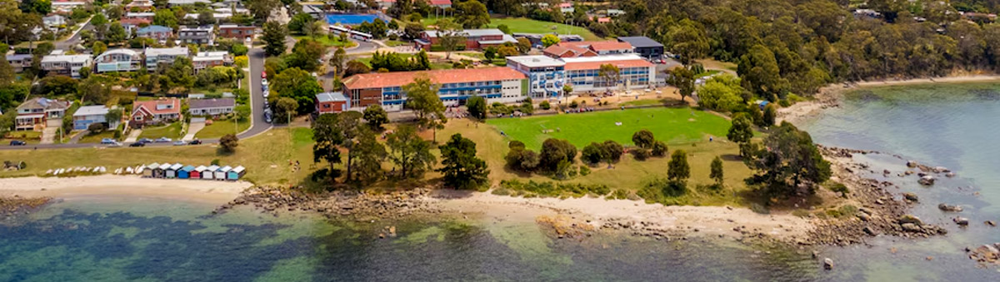

# première étude à l'étranger

## amélioration

<audio controls>
  <source src="/audios/1712515866_01.mp3" type="audio/mpeg" />
</audio>

Je suis né à Pékin, en Chine, et la plupart de mes expériences éducatives se sont déroulées là-bas.

Cependant, quand j'étais en 7e année, j'ai eu l'opportunité de participer à un programme d'échange international d'étudiants. Je suis allé en Australie pour étudier. J'ai vécu avec une famille d'accueil dans une ferme. Étant né et ayant grandi en ville, ce type d'expérience était totalement nouveau pour moi.

Le deuxième jour de mon arrivée dans cette famille, deux petites agnelles sont nées à la ferme. C'était l'été en Chine, mais l'hiver en Australie. Malheureusement, l'une d'elles était très faible et n'a pas survécu jusqu'au lendemain. Cela m'a choqué de voir qu'une vie puisse être donnée puis prise en si peu de temps, à mon âge. Je ne comprenais pas pourquoi la famille n'avait pas pris soin de l'agneau faible en le rentrant pour le réchauffer. Ils l'ont simplement laissé dehors, dans le froid, et l'ont laissé mourir. L'homme de la ferme m'a expliqué que c'était naturel, que les animaux doivent se débrouiller seuls pour survivre, et que c'est ainsi que nous obtenons des animaux en bonne santé à la ferme. L'autre agnelle était en bonne santé, nous avons pris une photo ensemble après les funérailles.

J'ai commencé l'école le lundi suivant. La famille nous conduisait, moi et leurs enfants, jusqu'à l'arrêt de bus scolaire principal. Cela prenait environ 30 minutes avant d'arriver en ville. Mon école était située au bord de la mer, nous pouvions nous rendre à la plage pendant les récréations. On m'a dit que la plage était orientée vers le sud, et que de l'autre côté de la mer se trouvait le continent Antarctique, bien que nous ne puissions pas le voir à l'œil nu. C'était tellement beau, j'adorais la vue !

Pour moi, les cours étaient assez simples, car j'avais déjà appris plus que ce qui était enseigné en Chine. Après les cours, je déjeunais à la cafétéria où il y avait des hamburgers, des frites et d'autres aliments considérés comme de la malbouffe en Chine et qui ne seraient jamais servis dans les cantines scolaires là-bas. Un jour, j'ai tellement bu de cola que j'ai dû me rendre aux toilettes. C'est là que j'ai trouvé trois portes : une pour les garçons, une pour les filles et une autre, au milieu, portant une étiquette rose indiquant "non-genré". Cet après-midi-là, beaucoup d'étudiants chinois comme moi ont découvert cela et le professeur nous a expliqué à quoi cela servait. Au début, je ne comprenais pas du tout. Nous avions des cours sur la santé chaque semaine, et après quelques semaines, j'ai finalement compris. Je ne trouvais pas étrange de voir un garçon porter une jupe à l'école, ni d'être assis à côté de deux hommes adultes se tenant la main et s'embrassant dans le bus. Il y a toutes sortes de personnes avec leurs propres choix de vie, et j'en verrai de plus en plus.

Après mon retour en Chine, il y avait aussi des garçons gays dans mon école. D'autres étudiants les évitaient ou leur disaient de mauvaises choses, mais pas moi. Je les traitais comme n'importe quel autre camarade de classe. Même aujourd'hui, j'ai beaucoup d'amis gays et lesbiennes, et pour moi, ce sont simplement mes amis comme tous les autres. Nous nous appelons, nous sortons ensemble pendant les vacances, et nous rions ensemble lors des dîners. La Chine est plus ouverte d'esprit maintenant, mais je pense que ce n'est toujours pas suffisant. Pendant ma vie professionnelle, j'entends encore beaucoup de gens juger les choix des autres, critiquer les autres. Un jour, j'ai même interviewé un candidat et la responsable des ressources humaines est venue me voir ensuite pour me dire qu'elle pensait qu'il était gay. J'ai acquiescé, car je le pensais aussi. Mais ensuite, elle m'a suggéré de donner la priorité à d'autres candidats du même calibre afin de ne pas créer de "malaise" au bureau. J'ai été profondément bouleversé en entendant cela, et je sais que ce genre de comportement ne se limite pas à quelques-uns.

Cette chance d'étudier en Australie à l'âge de 13 ans a jeté les bases de ma vision du monde, de ma manière de penser et de traiter les autres. C'est l'une des expériences les plus importantes qui ont contribué à façonner la personne que je suis aujourd'hui. C'est également à cette époque que j'ai célébré mon premier anniversaire, et jusqu'à présent, c'est le seul anniversaire d'hiver que j'ai jamais eu.

## originale

Je suis né à Pékin, en Chine. Et la plupart de mes expériences éducatives se sont déroulées en Chine.

Mais quand j'étais en 7e année, j'ai eu l'opportunité de rejoindre un programme d'échange international d'étudiants. Je suis allé en Australie pour étudier. Je vivais avec ma famille d'accueil dans une ferme. étant né et ayant grandi en ville, je n’ai jamais vécu ce genre d’expérience auparavant.

le deuxième jour de mon arrivée dans cette famille, 2 petites agnue ont accouché à la ferme. C'était l'été en Chine, mais l'hiver en Australie. Malheureusement, l'un d'entre eux était très faible et n'a pas survécu le lendemain. Cela m'a choqué de voir qu'une vie a été donnée puis prise en peu de temps à mon âge. Je ne comprenais pas pourquoi la famille n'avait pas emmené l'agneau faible à l'intérieur pour se réchauffer et n'en avait pas bien pris soin. ils l'ont simplement laissé dehors, dans le froid, et l'ont laissé mourir. Quand nous avons rencontré la petite vie dans la terre, l'homme m'a dit : c'est naturel, il faut qu'il soit sur lui-même pour vivre. c'est ainsi que nous pouvons avoir des animaux en bonne santé à la ferme. L'autre était en bonne santé, nous avons pris une photo ensemble après les funérailles.

J'ai commencé l'école le lundi suivant. La famille nous conduit, leurs enfants et moi, jusqu'à la route principale pour prendre le bus scolaire. Cela a pris environ 30 minutes puis nous sommes arrivés en ville. Mon école était au bord de la mer, on peut aller à la plage pendant les récréations. On m'a dit que la plage est orientée vers le sud, et que l'autre côté de la mer est le continent Antarctique. mais c'était loin donc nous ne pouvions pas voir de nos yeux. c'était tellement beau et j'ai adoré la vue !

Pour moi, les mathématiques étaient simples, car en Chine, j'avais déjà appris plus que ce qu'on y enseignait. Après le cours, je suis allé déjeuner à la cafétéria. Il y avait des hamburgers, des frites et d'autres aliments considérés comme de la malbouffe en Chine et qu'il serait impossible de servir dans les repas scolaires. Parce que j'ai trop bu de cola, je me suis ensuite dirigé vers la chambre des petits garçons. Là j'ai trouvé 3 portes, une pour les garçons, une pour les filles et celle du milieu dit non-genre avec l'étiquette en rose. Cet après-midi-là, beaucoup d'étudiants chinois comme moi ont également découvert cela et le professeur leur a expliqué à quoi cela servait. Au début, je ne comprenais pas du tout. Nous avions des cours sur la santé chaque semaine, après quelques semaines, j'ai enfin compris. Je ne me sens pas bizarre de voir un garçon porter des jupes à l'école, je ne me trouve pas gêné d'être assis avec deux hommes adultes se tenant la main et s'embrassant à côté de moi dans le bus. Il y a toutes sortes de personnes avec leurs choix faits pour leur vie. Et je verrai de plus en plus de choses.

Après mon retour en Chine, il y avait aussi des garçons gays dans mon école. D'autres étudiants les évitaient ou leur disaient de mauvaises choses. pas moi, je les traitais comme des camarades de classe normaux. Même maintenant, j'ai beaucoup d'amis gays et lesbiennes. Pour moi, ce sont mes amis comme tous mes autres amis. Nous parlons au téléphone, nous sortons pendant les vacances et nous rions en dînant. La Chine est plus ouverte d’esprit à l’heure actuelle, mais je peux dire que ce n’est pas suffisant. Pendant ma vie professionnelle, j'entends encore beaucoup de gens juger les choix des autres, mémérer sur les autres. Et une fois, j'ai interviewé un gars, puis la RH est venue me voir et m'a dit qu'elle pensait qu'il était gay. J'ai dit, eh bien oui, je peux voir ça. Mais ensuite, elle m'a suggéré de donner la priorité à d'autres candidats du même calibre afin de ne pas créer une atmosphère étrange dans le bureau. J'étais tellement bouleversé en entendant ça. Et pendant mes travaux, quelque chose comme ça ne se limite pas à quelques-uns.

Cette chance d'étudier en Australie quand j'avais 13 ans a jeté les bases de ma façon de voir le monde, de ma façon de penser les choses et de ma façon de traiter les autres. C’est l’une des expériences importantes qui ont fait de moi ce que je suis aujourd’hui. C'est également à cette époque que j'ai fêté mon premier anniversaire et même maintenant le seul anniversaire de l'hiver.
