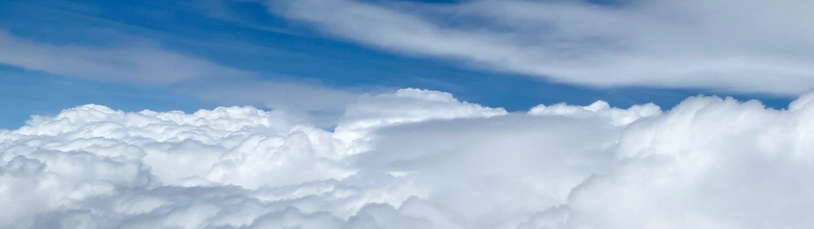

# lettre sur un voyage à Paris

## amélioration

<audio controls>
  <source src="/audios/1712432086_01.mp3" type="audio/mpeg" />
</audio>

Bonjour Alex,

Je t'écris aujourd'hui pour te faire part de la fin de mes vacances à Paris. Les conditions météorologiques ont été magnifiques pendant ces deux semaines, à l'exception d'une journée nuageuse et pluvieuse hier. J'ai eu l'occasion de visiter tous les endroits emblématiques de la ville, tels que la Tour Eiffel, l'Arc de Triomphe, et bien sûr, le Louvre où j'ai acheté cette carte postale. L'expérience était tout simplement époustouflante, tu sais, je suis un passionné d'art.

J'ai eu l'opportunité de pratiquer beaucoup de français, et j'ai été accueilli avec beaucoup d'enthousiasme par les habitants. En raison de mon accent québécois, ils ont rapidement deviné que je venais du Canada.

Hier soir, j'ai découvert un bar charmant au coin de la rue près de mon hôtel. La bière IPA qu'ils servaient était exquise. Si jamais tu as l'occasion de voyager ici à l'avenir, je te recommande vivement d'y faire un tour. Te souviens-tu de Thomas, notre camarade de lycée ? Eh bien, j'ai eu la chance de le rencontrer dans ce bar. Il est désormais réalisateur et travaille actuellement sur un documentaire consacré aux francophones. Il prévoit de se rendre au Québec cet été pour poursuivre son projet, et nous avons été invités à participer au tournage. Quelle surprise !

Je m'envole pour Berlin demain matin, et je rentrerai à Montréal dans deux semaines. J'ai également pris le soin de t'acheter un petit cadeau, mais je te laisse le plaisir de deviner ce que c'est.

À très bientôt !

Arthur

## originale

Bonjour Alex,

Aujourd'hui marque la fin de mes vacances à Paris. Le temps a été très beau ces deux semaines, sauf hier qui était nuageux et pluvieux. J'ai visité tous les endroits célèbres comme la Tour Eiffel, l'Arc de Triomphe, etc., bien sûr, le Louvre où j’ai acheté cette carte postale. C'était magnifique, tu sais, j'adore l'art.

J'ai pratiqué beaucoup de français, et les gens ici étaient très enthousiastes. À cause de mon accent québécois, ils ont deviné que je viens du Canada.

Hier soir, j’ai trouvé un bar au coin près de mon hôtel. La bière IPA était délicieuse. Je te la recommande si tu voyages ici à l'avenir. Te souviens-tu de Thomas, notre camarade de lycée ? Je l'ai rencontré dans le bar. Il est maintenant réalisateur. Il tourne actuellement un documentaire sur les francophones et viendra au Québec cet été. On pourra participer à son tournage. Quelle surprise !

Je pars pour Berlin demain matin et je retournerai à Montréal dans 2 semaines. Je t'ai acheté un cadeau, tu ne devineras pas ce que c'est.

À bientôt !

Arthur
