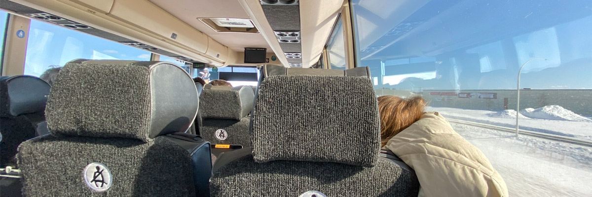
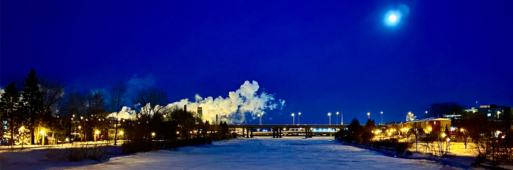

# première visite à Québec

## amélioration

<audio controls>
  <source src="/audios/1712626733_01.mp3" type="audio/mpeg" />
</audio>

Il y a quatre ans, j'ai fait ma première visite à Québec. Lors de ma deuxième visite à Montréal, j'ai acheté des billets aller-retour avec des réductions pour le mardi, deux semaines avant le départ. La veille, je suis allé passer un examen de vue et j'ai commandé de nouvelles lunettes. J'avais presque oublié que, à l'époque, il n'était pas nécessaire de réserver trois mois à l'avance pour l'examen, car il y avait des disponibilités le jour même.

Après être revenu de l'examen, je me suis assis sur le canapé en regardant les nouvelles à la télévision. J'ai reçu un e-mail sur mon téléphone portable. En l'ouvrant, j'ai découvert qu'il provenait de VIA. On m'informait que mon train pour Québec avait été annulé en raison d'une grève. En même temps, les actualités couvraient la grève du CN qui allait commencer le jour de mon départ en train. J'ai changé de chaîne pour regarder ici télé, où le journal diffusait en direct depuis la voie ferrée, montrant le blocage par le personnel. La manifestation semblait très sérieuse. Que devais-je faire ? J'ai alors consulté le site de VIA pour plus de détails : "Les passagers peuvent choisir entre changer les dates et demander un remboursement." Changer les dates n'était pas une option pour moi, car j'avais déjà payé mon séjour à Québec et il était non remboursable. Je me suis rappelé qu'il y avait une gare d'autocars près de l'UQAM. J'ai immédiatement vérifié la disponibilité des billets pour Québec. Il en restait quelques-uns ! Quelle chance ! J'ai choisi le départ le plus tôt. J'espérais que tout se passerait bien. J'ai ensuite préparé mes affaires, mis mes appareils à charger et prié pour que le bus ne soit pas annulé.

Je me suis levé vers 5 heures du matin et j'ai vérifié les horaires sur le site de l'autocar, tout était en ordre. Après avoir rapidement pris un peu de pain et de beurre, je me suis dirigé vers la gare. Il faisait encore nuit, comme lors de mon dernier voyage à Ottawa où je suis également parti tôt le matin. Quinze minutes plus tard, j'étais à la gare. Après avoir attendu un moment, l'embarquement a eu lieu et je me suis installé confortablement sur une chaise. La télévision diffusait les nouvelles sur les premiers cas de COVID en Amérique du Nord, et Trump disait : "Ce n'est rien de plus qu'une grippe !" Plus tard, je suis monté à bord du bus. Je n'avais qu'un seul sac à dos, je voyage toujours léger. Le bus était peu fréquenté, probablement parce qu'il était trop tôt. Je me suis assoupi jusqu'à notre arrivée à Québec.

À Québec, le terminus d'autocar et la gare sont au même endroit. Après avoir descendu du bus, j'ai traversé le hall de la gare vide et je suis sorti en direction du château. J'aime prendre mon temps pour apprécier le paysage en marchant lentement lorsque je visite une nouvelle ville. Selon la carte sur mon téléphone, cela ne prendrait que moins de 20 minutes à pied. Cependant, j'ai fini par arriver une heure plus tard, non pas parce que je marchais lentement pour admirer la vue sur le Vieux-Québec, mais parce que j'ai souvent changé d'itinéraire. Certaines routes étaient peu pentues, mais recouvertes de glace, ce qui m'a empêché de progresser. Je n'avais pas anticipé cette glace, portant simplement des chaussures normales, et je n'avais jamais rencontré ce problème à Montréal. J'ai donc passé la plupart de mon temps à chercher de nouveaux itinéraires et à faire des détours, ce qui m'a permis de découvrir presque toutes les rues du Vieux-Québec.

Après ma visite du château, j'ai passé l'après-midi à me promener dans le Vieux-Québec. Ensuite, je me suis dirigé vers le lieu où je logeais avant le coucher du soleil. Mon hébergement était situé dans le quartier Vieux-Limoilou, réservé via Airbnb. Malheureusement, cela signifiait qu'annuler ma réservation un jour avant n'était pas une option, et la politique de remboursement gratuit n'est entrée en vigueur que deux semaines plus tard, lors du début de la pandémie en Amérique. Malgré cela, je pourrais encore me déplacer à Québec aujourd'hui. J'ai passé une semaine à voyager entre le Vieux-Limoilou et le Vieux-Québec. Mon logement était un spacieux appartement de 5 1/2 pièces au deuxième étage d'une maison. Cependant, mon hôte, Alex, m'avait informé une semaine auparavant qu'il ne pourrait pas être présent, et Jimmy n'a pas pu venir non plus en raison de la grève ; il préfère voyager par la route plutôt que de prendre l'avion. Malheureusement, trouver un bus depuis Waterloo la veille s'était avéré impossible. Je dois admettre que je me suis senti un peu seul pendant ce séjour ; le salon à lui seul était plus grand que mon appartement actuel.

Mes journées et nuits étaient inversées, passant une grande partie de mes nuits à travailler avec mes collègues sur Zoom en raison de réunions importantes liées aux changements survenus en Chine à cause de la pandémie. Ces réunions nocturnes me laissaient souvent affamé au milieu de la nuit. C'est à ce moment à Québec que j'ai inventé une sorte de repas : le steak de 8 minutes. Je cuisinais le steak et les asperges dans une poêle à feu vif pendant exactement 8 minutes avant de les déguster. La plupart du temps, c'était même plus rapide que McDonald's, mais bien plus sain.

Je me déplaçais à pied entre le Vieux-Limoilou et le Vieux-Québec chaque jour, sauf un jour où, à cause d'une réunion tardive la nuit précédente, je décidai de prendre l'autobus. J'ai dormi plus longtemps que d'habitude, me réveillant à midi sans envie de marcher. J'ai alors utilisé l'application Transit, très populaire en Amérique du Nord et développée par une équipe basée à Montréal, pour vérifier les horaires des bus, et j'ai remarqué la ligne 800, qui relie Chute-Montmorency à Pointe-de-Sainte-Foy en passant par le Vieux-Québec.

J'avais abandonné l'idée de visiter la Chute Montmorency car Jimmy ne pouvait pas venir, sachant que je n'aimais pas conduire dans la neige, tandis que c'était parfaitement dans ses cordes. Cependant, en vérifiant les horaires de bus, j'ai réalisé que la chute n'était pas si loin de l'arrêt de bus. Je me suis donc rapidement préparé et je suis parti.

Il y avait peu de monde à la chute. En hiver, la cascade était gelée, de même que la rivière en contrebas. Le téléphérique semblait également fermé ce jour-là. J'apprécie toutes les saisons, que ce soit la mer ou les montagnes enneigées, donc cela ne m'a pas dérangé. En fait, j'étais plutôt content ce jour-là ; je cherchais un moment de calme, peut-être pas dans le parc, mais pour moi, c'était parfait.

Il y a eu de fortes chutes de neige cette nuit-là. Au Québec, il est habituel d'avoir d'importantes chutes de neige en hiver. Pendant que j'étais en réunion tard dans la nuit, j'ai entendu le bruit des travaux de déneigement dans le quartier. Le lendemain matin, j'ai déjeuné de la poutine dans un restaurant près du Studio Ubisoft de Québec. Je passais devant ce studio à chaque fois que je me déplaçais entre les deux quartiers. Le grand panneau sur le bâtiment m'a aidé à retrouver mon logement. Pour être honnête, j'ai essayé plusieurs poutines à Québec, mais je préfère celles des restaurants de Montréal.

La grève des travailleurs du CN semblait être terminée, mais en raison des chutes de neige, une partie de la voie ferrée était bloquée par la neige. Par prudence, j'ai choisi de prendre le bus pour retourner à Montréal. Bien que je ne sois parti de Montréal que pour une semaine, les changements étaient évidents. Beaucoup de gens portaient des masques, et de nouvelles affiches sont apparues dans la ville, surtout sur les portes des pharmacies et des dépanneurs, indiquant : "NOUS N'AVONS PLUS DE MASQUES DISPONIBLES."

## originale

J’ai visité à Québec il y a 4 ans pour la première fois. Pendant ma deuxième visite de Montréal, j’ai acheté les billets aller-retours avec les rabais de mardi 2 semaines avant la departure. La veille, je suis allée à l'examen de la vue et j'ai commandé mes nouvelles lunettes. J'avais presque oublié ça avant, comme à cette époque-là, il n'était pas nécessaire de réserver 3 mois avant l'examen ? il était disponible le jour même.

Après mon retour de l'examen, je me suis assis dans le sofa en regardant les nouvelles sur la télé. J’ai reçu un email sur mon cellulaire. Je l’ai dérouillé puis j’ai trouvé c’était de VIA. Il m’a notifié mon train pour Québec a été annulé à cause de la grève. et le même temps, les nouvelles couvraient l'actualité de grève du CN. Cela allait commencer le jour de mon train. en suite, j'ai changé le channel à ici télé, la télé journal diffusait en direct depuis le chemin de fer, les personnelles ont bloqué les vois. La manifestation, ça me sentais très sérieux. Qu'est-ce que je va faire? Puis je suis allé sur le site VIA pour plus de details: "les passagers peuvent choisir entre changer les dates et faire un remboursement." Changer les dates, c'était pas une option pour moi, j'avais déjà payé mes séjour pour Québec et cela était non remboursable. Je m'ai rappelé il y une gare d'autocar près l'UQAM. J'ai cherché immédiatement pour la disponibilité des billet pour Québec. Il en restais un peu! Quelle chance! J'ai choisis le plus tôt départ. J'espérais que je peux finalement dormir sur mes deux oreilles. Puis, j'ai emballé mes affaires et mis mes appareils en charger et j'ai prié il ne va pas être annulé.

Je me suis levé vers 5 heures le matin et j'ai vérifié sur le site d'autocar pour les horaires, tout allait bien. Après avoir un peux pain au beurre rapidement, je suis sorti pour la gare. Il faisait encore nuit, comme mon dernière fois pour Ottawa, je suis aussi parti tôt le matin. 15 minutes plus tard, je suis arrivé à la gare, je suis entré dans la salle d'attente, l'embarquement a eu lieu 30 minutes plus tard, je me suis reposé sur la chaise. La télévision dans la salle d'attente montrait les nouvelles des cas de COVID qui commençaient à apparaître en Amérique du Nord et Trump a dit : "c'est juste une grippe!" Plus tard, je suis monté à bord. Je n'avais qu'un seul sac à dos, je voyage toujours léger. Il n'y avait pas beaucoup de monde dans ce bus, je pensais que c'était parce qu'il était trop tôt. Après le départ du bus, j'ai dormi jusqu'à ce qu'il arrive à Québec.

À Québec, le terminus d'autocar et la gare sont ensemble. Je suis descendu du bus, j'ai traversé le hall d'attente du train vide et je suis sorti la gare pour le château. J'aime profiter du paysage au bord de la route en marchant lentement quand je visite une nouvelle ville. Selon la carte sur mon téléphone, cela ne prend que moins de 20 minutes à pied. Enfin, j'y suis arrivé une heure plus tard. Ne pas parce que je marchais très lentement pour profiter de la vue sur le Vieux-Québec mais parce que je changeais toujours de route. Il y avait quelques routes où les pentes n'étaient pas très raides, mais ce sont étaient couvert de glace. Quand je marchais dessus, je ne pouvais pas avancer du tout. C'était tellement glissant, je n'y étais pas préparé, je portais juste des chaussures normales et à Montréal, je n'avais pas du tout ce problème. J’ai donc passé la plupart de mon temps à choisir de nouveaux itinéraires et à faire des détours. Grâce à ça, j'apprends presque toutes les routes du Vieux-Québec.

Après avoir visité le château. Je passe l'après-midi à flâner dans le Vieux-Québec. Puis j'ai commencé à me diriger vers mon séjour avant le coucher du soleil. Mon séjour s'est déroulé dans le quartier Vieux-Limoilou. Je l'ai réservé cela sur Airbnb, je ne peux donc pas obtenir de remboursement si je l'annule seulement un jour avant. La politique de remboursement gratuit est arrivée 2 semaines plus tard, lorsque la pandémie a éclaté à l'amérique. Je peux encore m'y retrouver si je vais à Québec aujourd'hui. Je voyage entre le Vieux-Limoilou et le Vieux-Québec tous les jours pendant ma une semaine là-bas. Mon séjour était un grand 5 1/2 au deuxième étage d'une maison. Mais Alex s'est retrouvé occupé et m'a dit une semaine plus tôt qu'il ne pouvait pas venir. Et Jimmy n'a pas pu venir aussi à cause de la grève, il ne prend pas l'avion, il voyage toujours sur la route. Mais trouver un bus ici depuis Waterloo la veille était impossible. Je dois admettre que je me suis senti un peu seul pendant ce séjour, le salon à lui seul était plus grand que l'appartement que j'ai actuellement.

Je tournais le jour, la nuit, je prenais vers une heure pour travailler avec mes collèges sur Zoom. J'étais en vacances, mais pendant ce temps, tous mes collèges ont commencé à travailler à distance à cause de la pandémie, et je dois participer à des réunions importantes. Il y a eu beaucoup de changements en Chine. À cause des réunions nocturnes, j'avais faim pendant la nuit. C'est à cette époque à Québec que j'ai commencé une sorte de repas : le steak de 8 minutes. J'ai fait cuire le steak et les asperges ensemble dans une poêle à feu vif pendant 8 minutes, puis je prends le repas. La plupart du temps, c'est encore plus rapide que McDo, mais plus sain.

Je voyage entre le Vieux-Limoilou et le Vieux-Québec à pied tous les jours, sauf un jour où je n'ai pas traversé la rivière Saint-Charles et j'ai pris l'autobus. J'ai dormi plus tard que d'habitude car la réunion s'était déroulée tard la nuit précédente. Je me suis réveillé à midi et je n'avais pas envie de marcher. J'ai ouvert l'application Transit, très populaire en Amérique du Nord et créée par une équipe basée à Montréal, cherché l'autobus et j'ai vu la ligne 800. C'est une ligne reliant Chute-Montmorency et Pointe-de-Sainte-Foy à travers le Vieux-Québec.

J'ai abandonné mon idée de visiter cet automne parce que Jimmy ne pouvait pas venir. Je n'aime pas conduire dans la neige, mais ça va tout à fait pour Jimmy. Ainsi pendant les hivers, lorsque nous voyageons, c'était toujours Jimmy qui conduisait, surtout dans la neige. Juste par curiosité, j'ai vérifié l'autre direction jusqu'à la chute, le prochain autobus arrive l'arrêt Cégep Limoilou est dans 8 minutes, et arrive la Chute Montmorency 30 minutes plus tard. J'ai soudain réalisé que ce n'était pas si loin, la chute et l'arrêt de bus. Je me suis levé rapidement et me suis préparé en seulement 3 minutes, puis je suis parti.

il n'y avait pas beaucoup de monde à la chute. En fait, quelques-uns seulement. En hiver, la chute était gelé, ainsi que la rivière en contrebas. il semble que le téléphérique soit aussi fermé ce jour-là. J'aime toutes les saisons, la mer ou les montagnes enneigées. Donc ça ne m'a pas dérangé du tout. En fait, j'étais plutôt content ce jour-là, je voulais profiter d'un moment de calme ce jour-là, peut-être pas pour le parc, mais pour moi c'était parfait.

Il y a eu de fortes chutes de neige cette nuit-là. Au Québec, il est normal de neiger abondamment en hiver. Alors que j'étais en réunion la nuit, j'ai entendu le bruit des travaux de déneiger dans le quartier. le lendemain matin, j'ai mangé de la poutine dans un restaurant près du Studio Ubisoft de Québec. Je passais devant ce studio chaque fois que je voyageais entre les deux quartier. Et le grand panneau sur l'édifice m'a aidé à rentrer au séjour. La poutine, pour être honnête, j'ai essayé quelques poutines à Québec, mais j'aime plus les restaurants de Montréal.

La grève des travailleurs du CN semblait terminée, mais à cause des chutes de neige, une partie du chemin de fer a été bloquée par la neige. Étant plus prudent, j'ai choisi l'autobus pour retourner à Montréal. je n'ai quitté Montréal que pour 1 semaine, mais le changement était évident. Beaucoup de gens portent des masques. Et une nouvelle pancarte est apparue dans la ville, principalement sur les portes des pharmacies et des dépanneurs, qui dit : "NOUS N'AVONS PLUS DE MASQUES DE DISPONIBLE"
