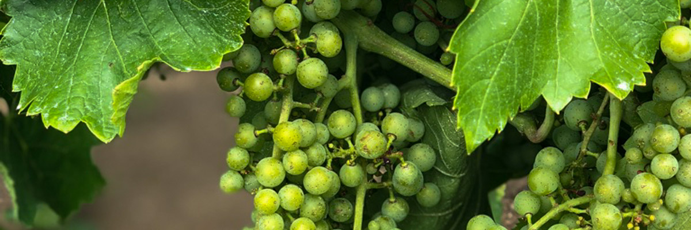
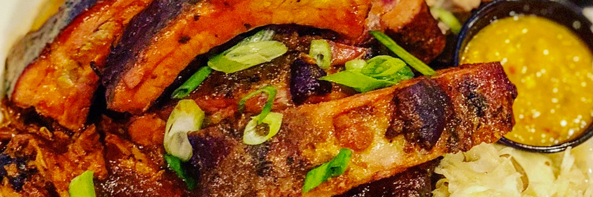

# vin de glace

## amélioration

<audio controls>
  <source src="/audios/1712810136_01.mp3" type="audio/mpeg" />
</audio>

J'ai vu un garçon aux cheveux rasés et avec de grosses lunettes portant un sweat à capuche lorsque je suis entré dans la salle d'attente. Je savais que c'était lui, Jimmy. Eh bien, il n'y avait pas d'autres Asiatiques à l'aéroport Pearson ce matin-là. Il était plus maigre que lors de notre dernière rencontre. Je pensais qu'il avait adopté une alimentation plus saine. Peut-être aussi parce qu'il donne souvent du sang. On s’est embrassé légèrement puis on est sortis au parking. Il a loué une voiture pour venir me chercher. Il a eu son permis de conduire il y a 2 ans et il conduisait plutôt bien.

Il m'a conduit à mon séjour au St. Paul's University College à UWaterloo. C'était samedi et j'ai reçu la veille un email m'expliquant comment récupérer ma clé de ma chambre d’invité puisqu'il n'y avait pas de personnel ce jour-là. Ce n'était pas la haute saison pour les séminaires, donc il n'y avait qu'une seule enveloppe à la réception. J'ai fait mon enregistrement et j'ai trouvé ma chambre. Ce soir-là, il m'a emmené dans un restaurant de rôti de porc qu'il aimait beaucoup et qu'il fréquentait très souvent. C'est à ce moment-là que j'ai découvert que j'avais tort en disant que son alimentation était plus saine qu'avant.

La construction du tramway et des voies était déjà terminée l'année précédente. Mais comme Bombardier a retardé la livraison des trains, le service d’ION rapid transit a commencé à fonctionner 11 mois plus tard après ma visite. C’était l'autre raison pour laquelle Jimmy avait loué une voiture pendant mon séjour là-bas.

Le jour suivant, on est allés aux États-Unis après la visite des chutes. Il devait y récupérer un colis. Les douaniers sont habitués aux gens de passage pour y acheter des choses moins chères. Et comme c'était dimanche, il y avait beaucoup de voitures sur le pont arc-en-ciel. Lorsque nous sommes revenus du côté canadien, il était encore midi. Et il n'y avait pas grand-chose à faire si on retournait à Kitchener aussi tôt. Il a appelé son coloc pour lui demander des suggestions, puis on est partis vers le nord.

Environ 20 minutes plus tard, alors qu'il passait devant des champs de raisin, il a quitté la route. On est arrivés dans un domaine viticole, le domaine Inniskillin Niagara.

La prochaine visite publique a commencé après notre arrivée. Elle offrait un rare aperçu des coulisses de la fabrication des vins de glace, avec tous les aspects de la vinification explorés, de la vigne à la cave. Je n'aurais jamais pensé que ma première expérience de visite d'un vignoble aurait eu lieu au Canada. C'est un peu différent de faire des vins rouges, mais tant qu'il y avait du vin dégusté, j'étais content. Comme vin de dessert, bien sûr, il est sucré. Je ne sais pas si c'était à cause de l'expérience unique que j'ai vécue, ou parce que je n'avais pas bu de vin depuis quelques jours, ou parce que j'avais le verre dans le nez, ce qui m'a rendu heureux. Ou peut-être les deux. J'en ai acheté comme cadeaux pour Tommy et Tim avant notre départ. Mais ils se sont retrouvés vides avant que je quitte l'Ontario pour retourner en Californie. Je les ai tous finis moi-même !

En rentrant, on avait tous les deux un peu faim. Il m'a dit qu'il y avait un restaurant qu'il aimait juste avant Hamilton, sur le chemin du retour vers Waterloo. Je ne savais pas ce que c'était jusqu'à ce que on se gare devant le restaurant avec le panneau : "Memphis Fire Barbeque Company". Je lui ai dit que je reprenais, je pense qu'il avait changé son alimentation de manière plus saine. Mais je ne nierai pas que les côtes qu'on avait là-bas étaient tellement bonnes !

## originale

J'ai vu un gar aux cheveux rasé et avec lunettes épaisses portant un sweat à capuche lorsque j'entrais dans la salle d'attente. Je savais que c'était lui, Jimmy. Eh bien, il n'y avait pas d'autres Asiatiques à l'aéroport Pearson ce matin-là. Il était plus maigre que lors de notre dernière rencontre. Je pensais qu'il avait adopté une alimentation plus saine. Peut-être aussi parce qu'il donne souvent du sang. On s’est embrassé légèrement puis on est sortie au parking. Il a loué un char pour venir me chercher. Il a eu son permis de conduire il y a 2 ans et il conduisait plutôt bien. 

Il m'a conduit à mon séjour au St. Paul's University College à UWaterloo. C'était samedi et j'ai reçu la veille un email m'expliquant comment retrouver ma clé de ma chambre d’invité puisqu'il n'y avait pas de personnel ce jour-là. Ce n'était pas la haute saison pour les séminaires donc il n'y avait donc qu'une seule enveloppe à la réception. Je me suis servi pour l'enregistrement et j'ai trouvé ma chambre. Ce soir-là, il m'a emmené dans un restaurant de rôti de porc qu'il aimait beaucoup et qu'il fréquentait très souvent. C'est à ce moment-là que j'ai découvert que j'avais tort en disant que son alimentation était plus saine qu'avant.

La construction du tramway et des voies étaient déjà terminées l'année précédente. Mais comme Bombardier a retardé la livraison des trains, le service d’ION rapid transit a commencé à fonctionner 11 mois plus tard après ma visite. C’était l'autre raison pour laquelle Jimmy avait loué un char pendant mon séjour là-bas.

Le jour suivant, on est allé aux États-Unis après la visite des chutes. Il devait y récupérer un colis. Les douaniers sont habitués aux gens de passage pour y acheter des choses moins chères. Et comme c'était dimanche, il y avait beaucoup de voitures sur le pont arc-en-ciel. Lorsque on est revenu du côté canadien, il était encore midi. Et il n'y avait pas grand-chose à faire si on retournait à Kitchener aussi tôt. Lorsque on est revenus du côté canadien, il était encore midi. Et il n'y avait pas grand-chose à faire si on retournait à Kitchener aussi tôt. Il a appelé son coloc pour lui demander des suggestions, puis on est partis vers le nord. 

Environ 20 minutes plus tard, alors qu'il passait devant des champs de raisin, il a quitté la route. On est arrivés dans un domaine viticole, le domaine Inniskillin Niagara.

La prochaine visite publique a commencé après notre arrivée. Elle offrait un rare aperçu des coulisses de la fabrication des vins de glace, avec tous les aspects de la vinification explorés, de la vigne à la cave. Je n'aurais jamais pensé que ma première expérience de visite d'un vignoble aurait eu lieu au Canada. C'est un peu différent de faire des vins rouges, mais tant qu'il y avait du vin dégusté, j'étais content. Comme vin de dessert, bien sûr, il est sucré. Je ne sais pas si c'était à cause de l'expérience unique que j'ai vécue, ou parce que je n'avais pas bu de vin depuis quelques jours, ou parce que j'avais le verre dans le nez, ce qui m'a rendu heureux. Ou peut-être les deux. J'en ai acheté comme cadeaux pour Tommy et Tim avant notre départ. Mais ils se sont retrouvés vides avant que je quitte l'Ontario pour retourner en Californie. Je les ai tous finis moi-même !

En rentrant, on avait tous les deux un peu faim. Il m'a dit qu'il y avait un restaurant qu'il aimait juste avant Hamilton, sur le chemin du retour vers Waterloo. Je ne savais pas ce que c'était jusqu'à ce que on se garait devant le restaurant avec le panneau : " Memphis Fire Barbeque Company". Je lui ai dit que je reprenais, je pense qu'il avait changé son alimentation de manière plus saine. Mais je ne nierai pas que les côtes qu'on avait là-bas étaient tellement bonnes !

