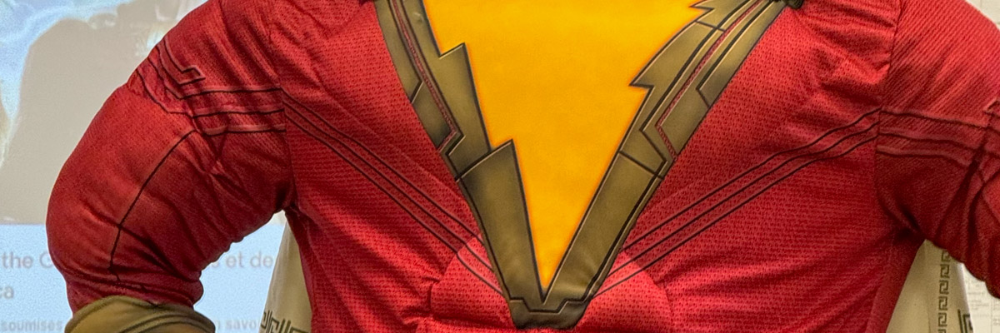

# Allons-y

## amélioration

<audio controls>
  <source src="/audios/1712897374_01.mp3" type="audio/mpeg" />
</audio>

« Wibbly wobbly, timey wimey », c’est une phrase iconique que j’aime beaucoup du dixième docteur. Je l’utilisais souvent pendant mon travail. Je me souviens que j’ai commencé à suivre la série « Doctor Who » depuis le reboot en 2005. C’est une série télévisée de science-fiction que j’aime beaucoup. Je me souviens de tous les épisodes de son reboot de 2005 à 2017. L’acteur du douzième docteur ressemble beaucoup à l’un des professeurs de ma francisation au Centre Champlain où j’ai commencé à apprendre le français à partir d’octobre 2023.

J’y ai commencé ma classe avec Laurent et Sophie, ils sont tous les deux québécois et tous les deux de très bons professeurs. Les professeurs là-bas sont tous géniaux, mais ceux-ci sont mes préférés, et ce sont aussi ceux qui m’ont enseigné le plus longtemps. Exactement un mois après le début de mes cours, les FAE ont commencé leur grève générale illimitée le 23 novembre 2023 et ma classe s’est arrêtée il y a 2 jours. Ce n’est pas la troisième grève qui me touche directement au Canada. Les deux dernières étaient celles des travailleurs du CN et celle du gouvernement du Canada. Eh bien, il y en a eu une autre avant la grève de la FAE aussi, la grève des travailleurs du Casino de Montréal, la dernière fois que j’y suis allé pour leur buffet mais les restaurants étaient fermés à cause de la grève. Au début, je pensais qu’on retournerait à l’école après une ou deux semaines, mais c’était le 9 janvier 2024 quand on est retournés en classe. À cause de cela, mon cours de niveau 4 a été prolongé de 2 mois supplémentaires.

Les étudiants se manquaient beaucoup, et après cela on s’est rapprochés et on a appris à mieux se connaître. C’est la meilleure classe que j’ai eue là-bas. Prince, Abdul et moi, on a commencé à pratiquer le français ensemble après l’école. La première fois que j’ai rencontré Prince, c’était le premier jour d’école, on était les 2 premiers élèves arrivant en classe et attendant à l’extérieur de la classe. Abdul était toujours en retard et arrivait après le début du cours avec 20 minutes ou plus de retard. Olivia a rejoint notre petit groupe d’étude du français après que on soit arrivés au niveau 5. Elle a été transférée dans notre classe de niveau 4 après la grève. Avant son arrivée, j’étais le seul chinois dans la classe, et j’en étais content, c’était vraiment bien pour moi d’essayer de parler français dans la classe puisque les autres ne connaissaient pas le chinois. Au début, elle essayait souvent de parler chinois avec moi en classe, il lui a fallu un certain temps pour s’habituer à parler moins chinois.

On a réussi l’examen de niveau 4 ensemble. Lors de la fête d’après, chaque élève a apporté un plat au dîner, moi, bien sûr, j’ai choisi d’apporter les sushis que j’avais préparés ce matin-là. La semaine prochaine, la plupart d’entre nous seront encore ensemble au niveau 5 mais Abdul ira dans une autre école pour le niveau 5. On s’est moins rencontrés par la suite.

Avant le Centre Champlain, j’ai appris un peu le français mais c’est là où j’ai vraiment commencé à apprendre. C’est aussi là que j’ai appris l’utilisation de la lettre “y”. Ce jour-là, j’ai soudain découvert un autre mot, « Allons-y », souvent utilisé par le 10ème docteur, est français ! Je pensais que c’était italien. J’aurais dû le savoir si j’avais vérifié ce mot auparavant, mais je ne l’ai pas fait. Les séries m’ont beaucoup manqué, et j’ai commencé à revoir tous les épisodes de 2005 à 2017, en français.

## originale

« Wibbly wobbly, timey wimey », c’est une phrase iconique que j’aime beaucoup de le dixième docteur. Je l’utilisais souvent pendant mon travail. Je me souviens que j’ai commencé suivre la série « Doctor Who » depuis le reboot en 2005. C’est une série télévisée de science-fiction que j'ai beaucoup aimée. Je me souviens de tous les épisodes de son reboot de 2005 à 2017. L'acteur du douzième docteur ressemble beaucoup à l'un des professeurs de ma francisation au Centre Champlain où j'ai commencé à apprendre le français à partir d'octobre 2023. 

J'y ai commencé ma classe avec Laurent et Sophie, ils sont tous les deux québécois et tous les deux de très bons professeurs. Les professeurs là-bas sont tous géniaux, mais ceux-ci sont mes préférés, et ce sont aussi ceux qui m'ont enseigné le plus longtemps. Exactement un mois après le début de mes cours, les FAE ont commencé leur grève générale illimitée le 23 novembre 2023 et ma classe s’était arrêté il y a 2 jours. Ce n'est pas la troisième grève qui me touche directement au Canada. Les deux derniers étaient les travailleurs du CN et le gouvernement du Canada. Eh bien, il y en a une autre avant la grève de la FAE aussi, la grève des travailleurs du Casino de Montréal, la dernière fois que j'y suis allé pour leur buffet mais les restaurants étaient fermés à cause de la grève. Au début, je pensais qu'on retournait à l'école après une ou deux semaines, mais c'était le 9 janvier 2024 quand on est rentrés en classe. À cause de cela, mon cours de niveau 4 a été prolongé de 2 mois supplémentaires.

Les étudiants se manquaient beaucoup, et après cela on s'est rapprochés et a appris à mieux se connaître. C'est la meilleure classe que j'ai eu là-bas. Prince, Abdul et moi, on a commencé à pratiquer le français ensemble après l'école. La première fois que j'ai rencontré Prince, c'était le premier jour d'école, on était les 2 premiers élèves arrivant en classe et attendant à l'extérieur de la classe. Abdul était toujours en retard et arrive après le début du cours avec 20 minutes ou plus de retard. Olivia a rejoint notre petit groupe d'étude du français après que on soit arrivés au niveau 5. Elle a été transférée dans notre classe de niveau 4 après la grève. Avant son arrivée, j'étais le seul chinois dans la classe, et j'en étais content, c'est vraiment bien pour moi d'essayer de parler français dans la classe puisque les autres ne connaissent pas le chinois. Au début, elle essayait souvent de parler chinois avec moi en classe, il lui a fallu un certain temps pour s'habituer à parler moins chinois.

On a réussi l'examen de niveau 4 ensemble. Lors de la fête d'après, chaque élève a apporté un plat au dîner, moi, bien sûr j'ai choisi d'apporter les sushis que j'avais préparés ce matin-là. La semaine prochaine, la plupart d'entre nous seront encore ensemble au niveau 5 mais Abdul allait dans une autre école pour le niveau 5. On s’est moins rencontrés par la suite.

Avant le Centre Champlain, j'ai appris un peu le français mais c'est là où j'ai vraiment commencé à apprendre. C'est aussi là que j'ai appris l'utilisation de la lettre y. Ce jour-là, j'ai soudain découvert un autre mot , « Allons-y », le 10ème souvent utilisé, est français! Je pensais que j'étais italien. J'aurais dû le savoir si j'avais vérifié ce mot auparavant, mais je ne l'ai pas fait. Les séries m'ont beaucoup manqué, et j'ai commencé à revoir tous les épisodes de 2005 à 2017, en français.